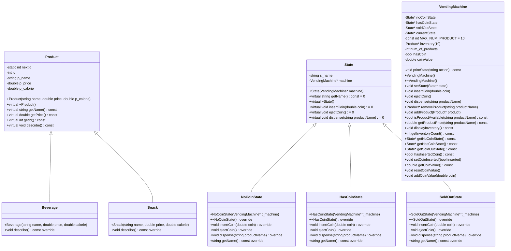

```mermaid
classDiagram
    Product <|-- Beverage
    Product <|-- Snack
    State <|-- NoCoinState
    State <|-- HasCoinState
    State <|-- SoldOutState
    class Product{
        -static int nextId 
        -int id 
        -string p_name 
        -double p_price 
        -double p_calorie 
        +Product(string name, double price, double p_calorie) 
        +virtual ~Product() 
        +virtual string getName() const 
        +virtual double getPrice() const 
        +virtual int getId() const 
        +virtual void describe() const 
    }
    class Beverage{
        +Beverage(string name, double price, double calorie)
        +void describe() const override
    }
    class Snack{
        +Snack(string name, double price, double calorie)
        +void describe() const override
    }
    class State{
        -string s_name
        -VendingMachine* machine
        +State(VendingMachine* machine)  
        +virtual string getName() const = 0  
        +virtual ~State()  
        +virtual void insertCoin(double coin) = 0  
        +virtual void ejectCoin() = 0  
        +virtual void dispense(string productName) = 0  
    }
    class NoCoinState{
        +NoCoinState(VendingMachine* t_machine)
        +~NoCoinState() override
        +void insertCoin(double coin) override
        +void ejectCoin() override
        +void dispense(string productName) override
        +string getName() const override
    }
    class HasCoinState{
        +HasCoinState(VendingMachine* t_machine)
        +~HasCoinState() override
        +void insertCoin(double coin) override
        +void ejectCoin() override
        +void dispense(string productName) override
        +string getName() const override
    }
    class SoldOutState{
        +SoldOutState(VendingMachine* t_machine)
        +~SoldOutState() override
        +void insertCoin(double coin) override
        +void ejectCoin() override
        +void dispense(string productName) override
        +string getName() const override
    }
    class VendingMachine{
        -State* noCoinState  
        -State* hasCoinState  
        -State* soldOutState  
        -State* currentState  
        -const int MAX_NUM_PRODUCT = 10  
        -Product* inventory[10]  
        -int num_of_products
        -bool hasCoin
        -double coinValue
        -void printState(string action) const
        +VendingMachine()  
        +~VendingMachine()  
        +void setState(State* state)  
        +void insertCoin(double coin)  
        +void ejectCoin()  
        +void dispense(string productName)  
        +Product* removeProduct(string productName)  
        +void addProduct(Product* product)  
        +bool isProductAvailable(string productName) const  
        +double getProductPrice(string productName) const  
        +void displayInventory() const  
        +int getInventoryCount() const 
        +State* getNoCoinState() const 
        +State* getHasCoinState() const 
        +State* getSoldOutState() const 
        +bool hasInsertedCoin() const 
        +void setCoinInserted(bool inserted) 
        +double getCoinValue() const 
        +void resetCoinValue() 
        +void addCoinValue(double coin)
    }
```